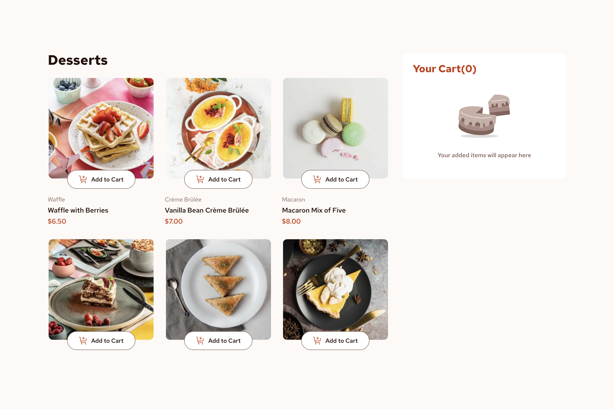

# Product list with cart

## Overview

### Screenshot

This is a partial screenshot of the final view of the project.

### Links

- Solution URL: [https://github.com/jaylspace/product-list-with-cart](https://github.com/jaylspace/product-list-with-cart)
- Live View URL: [https://product-list-with-cart-jayl.vercel.app](https://product-list-with-cart-jayl.vercel.app)

## My Process

### Basic

This project is built with no external libraries. It used semantic HTML5 elements, CSS3 for the styles, and vanilla JavaScript for DOM manipulations.

Thought it would be hard using only vanilla JavaScript, but actually it wasn't. The reason why I started off with only vanillas is because I wanted to challenge myself and I'm glad I did. If not, I would have gone for sort of an easy way which is using React.js.

### Structure

The skeleton of the project itself is quite simple since all the list items(products, cart, confirmed order) are generated by JavaScript and not hard coded.

### Stylings

I used `rem` instead of `px` as I normally do. Also, I divided CSS into multiple files instead of storing all the codes into a one big file. For the layout and gap sizes, I measured its `px` from the preview design by using Adobe Photoshop CC.

### JavaScript

For the data, I stored a deep copy into a new array with objects, which is like a JSON format. Every calculations and displayings are based on that main data. That's why it seemed like the data has to be intertwined with lot of functions, it's not a recommended way, but I had to manipulate the data itself so all the related functions can share the exact same data.

### Troubleshooting

Importing `data.json`, which came with the project, was keep failing by the MIME type error. So I had to change the JSON file extension into JavaScript file and manually export the data.
